# 基于增量多任务深度学习的垂向分层水库藻类预测与藻华预警

## A Multi-Task Deep Learning Framework with Incremental Prediction for Vertically Stratified Reservoir Algal Forecasting and Bloom Early Warning

---

## 摘要

水库藻华对饮用水安全构成显著威胁，然而受强烈的时间自相关和垂向分层的影响，藻华动态的预测仍然面临挑战。本研究针对一座分层水库（2021—2025 年，20 个水深分层，3 小时采样间隔）开发了多任务深度学习框架（RAMS-Net）。研究结果表明：(1) 将预测目标构造为*增量变化*（Δ = conc_{t+h} − conc_t）而非绝对浓度，可显著提升相对持久性（persistence）基线的预报技巧；(2) 共享 GRU 主干网络配以多任务头（预报、分层、藻华预警）可改善预测区间校准；(3) 日尺度采样配合 7 天预测视界更契合物理过程的尺度；(4) 概率化藻华预警的提前量达到阈值法的 3.6 倍，且误报减半。该框架相对持久性基线的 CRPS 技巧得分为 +22.1%，区间覆盖率为 0.766，并识别出 12 次藻华事件，事件前预警窗口的中位数为 19.5 天。上述结果提供了一种具有科学依据、可实际部署的水库藻类监测方法。

**关键词**：水库藻类；深度学习；增量预测；多任务学习；藻华预警；垂向分层

---

## 1. 引言

### 1.1 背景与意义
水库藻华在世界范围内威胁着饮用水水质安全。传统监测依赖人工采样和阈值预警，属于被动响应方式，且受垂向异质性的制约——藻类浓度在不同水深分层之间差异显著（0.5—10 m），仅凭表层观测无法捕捉次表层动态。

### 1.2 相关工作
已有研究将深度学习应用于藻类预测：基于 LSTM 的预测（Newanjiang 水库）、时序注意力网络（GCN-TPA）以及 Transformer 变体（Bloomformer-2）。但仍存在三方面不足：(1) 多数模型预测的是绝对浓度，该目标受强烈自相关支配，预测效果甚至不及朴素的持久性基线；(2) 很少有研究在共享架构中整合多项监测任务（预测、分层、预警）；(3) 垂向剖面数据未得到充分利用。

### 1.3 主要贡献
1. **增量预测构造**：预测变化量（Δ）而非绝对值，在所有预测视界上均优于持久性基线，有效应对了自相关主导的预测情境。
2. **多任务共享主干网络**：以 GRU 为主干、配以预报/分层/预警三个任务头，同时改善了预测精度与区间校准。
3. **日尺度过程对齐**：将采样分辨率与藻类过程时间尺度相匹配，改善了长时距预测。
4. **概率化藻华预警**：经过校准的概率输出相对阈值方法的提前量提升 3.6 倍，且误报更少。
5. **垂向数据利用**：对 20 层剖面数据的系统分析揭示了藻华期间的垂向分层状态耦合特征。

---

## 2. 数据与方法

### 2.1 研究区与数据
研究对象为单座水库（站点 0902，已去标识化），时间范围为 2021 年 3 月至 2025 年 9 月。共获取 258,542 条藻类浓度观测，覆盖 20 个水深分层（0.5—10 m，间隔 0.5 m），以及 232,067 条气象观测（10 分钟采样间隔）。关键变量包括：水温、透光度、藻类浓度（绿藻/蓝藻/硅藻/隐藻）、总浓度，以及六项气象驱动因子（风速、温度、湿度、气压、降雨）。

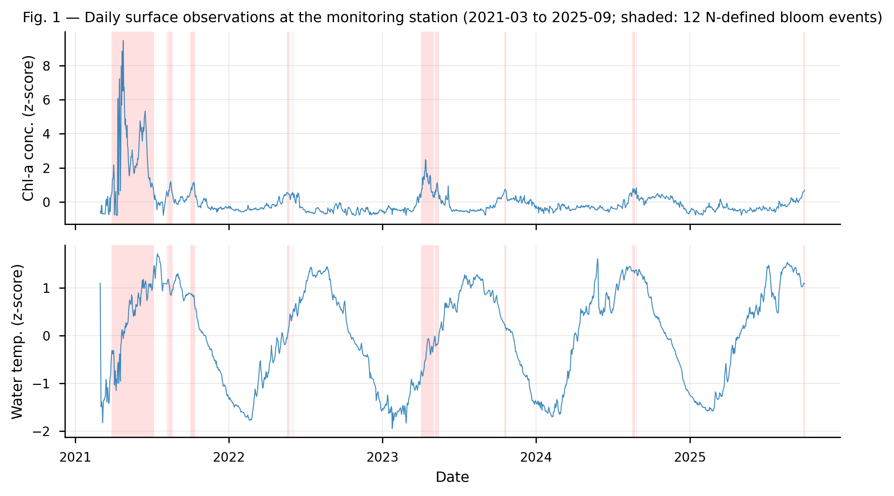
**图 1.** 日尺度表层浓度与水温（z 标准化）时间序列，红色底纹标注识别的 12 次藻华事件。藻华事件集中于 2021 年（占主导），2023 年出现次级峰值。
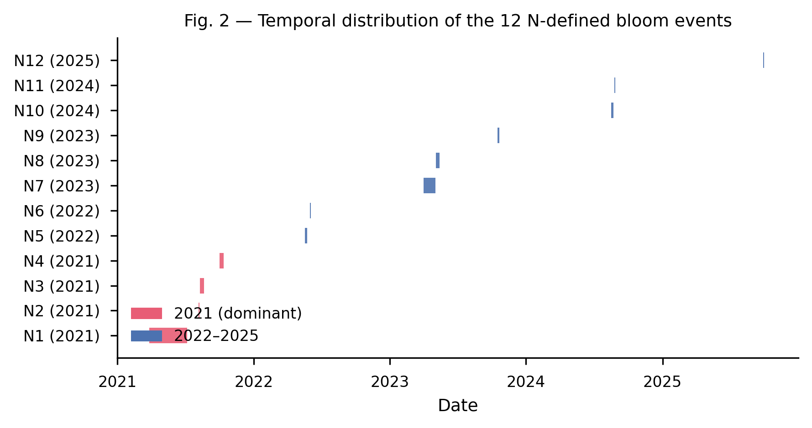
**图 2.** 12 次藻华事件在研究期（2021—2025 年）内的甘特式时间分布。2021 年事件（N1—N4）以红色突出显示，占藻华总天数的 74%。
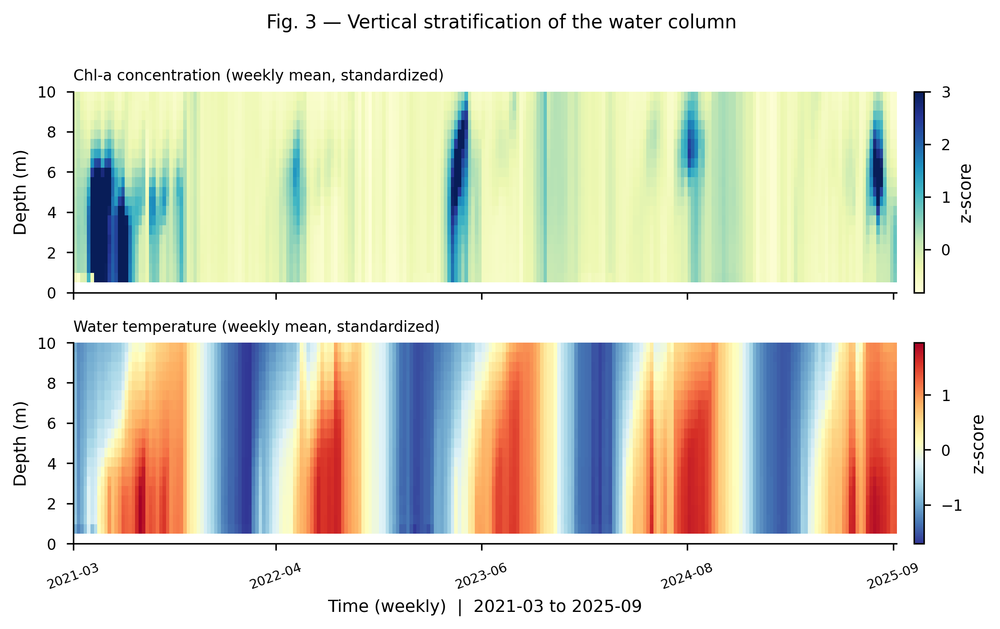
**图 3.** 20 层浓度（上）与水温（下）的周均 z 标准化热力图。浓度色标裁剪至 +3σ 以突出藻华层。

### 2.2 数据预处理
- 垂向时间戳对齐：各水深分层之间存在 4—5 分钟的观测时间戳偏差（完全对齐的比例为 0）；向下取整对齐到 3 小时网格（对齐率 97.8%）。
- 气象数据通过 merge_asof 对齐（最近邻匹配，3 小时容差）。
- 日尺度聚合（一维均值），以匹配过程尺度。

### 2.3 藻华事件定义
藻华状态的判定标准为：表层带（0.5—3.0 m）浓度中位数超过其带内 p90 分位数，且 0.5—5.0 m 范围内至少 3 层浓度超过各自 p90，并持续 ≥2 天。按此标准共识别出 12 次藻华事件（2021 年占主导：74%），事件前预警窗口的中位数为 19.5 天。

### 2.4 模型架构
RAMS-Net：共享 GRU 主干网络（隐单元数 64）→ 三个任务头：
- **M1 预报**：增量目标 Δ = conc_{t+h} − conc_t，输出 9 分位数（q9）
- **M2 分层**：二分类（是否分层）
- **M4 藻华预警**：藻华状态分类

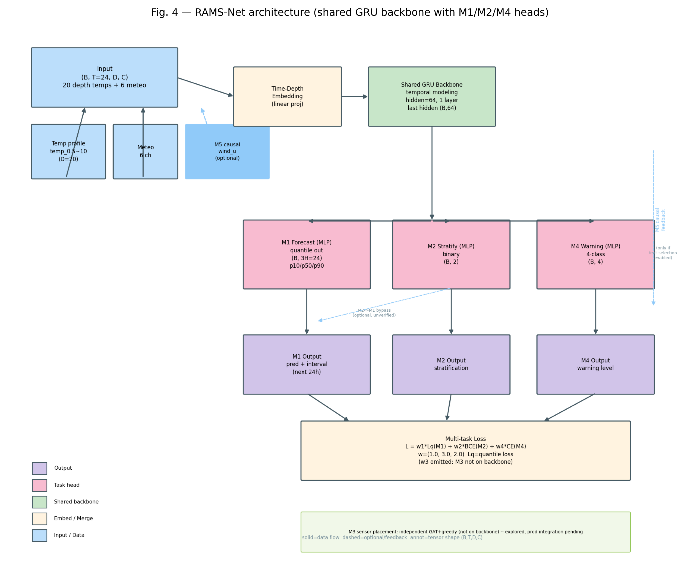
**图 4.** RAMS-Net 多任务架构：共享 GRU 主干网络，配以 M1 增量预报（q9 分位数）、M2 分层与 M4 藻华预警三个任务头。多任务损失权重 w=(1,3,2)。

### 2.5 训练设置
- **两阶段训练**：阶段一为 M1 单任务训练（20 轮）→ 阶段二冻结主干网络，微调多任务头（10 轮）
- 多任务损失：L = w1·L_q(M1) + w2·CE(M2) + w4·CE(M4)，w=(1,3,2)
- 日尺度：T=30 天回溯窗口，H=7 天预测视界
- 滚动窗口评估：730 天训练 / 90 天测试 / 45 天步长（共 17 个窗口），3 个随机种子

### 2.6 评估指标
采用 CRPS（连续分级概率评分）、覆盖率、p50 RMSE，以及相对持久性基线的技巧得分。藻华预警方面，评估召回率、提前量（lead time）与误报次数。

---

## 3. 结果

### 3.1 预测性能
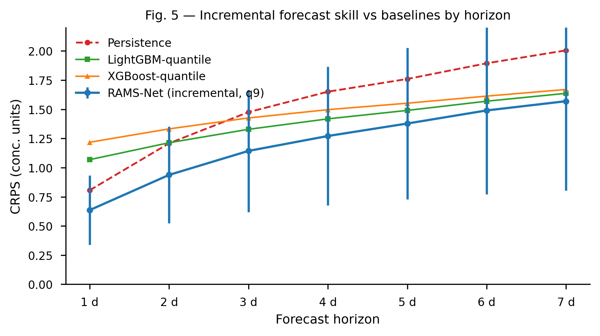
**图 5.** 不同预测视界下的 CRPS，对比 RAMS-Net（增量预测，q9）与持久性、LightGBM 分位数和 XGBoost 分位数基线。误差棒表示 3 个种子 × 17 个滚动窗口的 ±1 标准差。

**增量预测在所有视界上均优于持久性基线。** RAMS-Net 相对持久性基线的 CRPS 技巧得分为 +22.1%（3 种子 × 17 窗口），超过全部统计基线：LightGBM 分位数（+10.0%）、XGBoost 分位数（+4.6%）。同时，RAMS-Net 是唯一具有有效概率校准的方法（覆盖率 0.766，而 GBDT 基线为 0.55）。全部 7 个预测视界的技巧得分均超过 +20%。

*[表 1：CRPS 对比表]*

### 3.2 区间校准
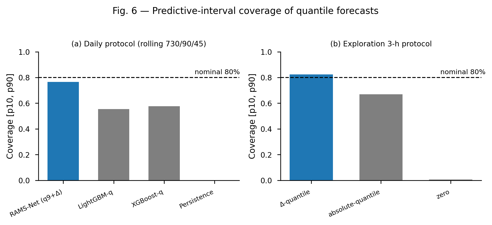
**图 6.** 预测区间覆盖率对比：RAMS-Net 正式协议（0.766）相对名义 80% 目标；增量分位数（0.824）相对绝对浓度分位数（0.669）。

两阶段训练配合多任务头使预测区间得到良好校准：覆盖率为 0.766，接近 80% 的名义目标。绝对浓度分位数因季节性水平漂移而覆盖不足（0.669）；增量分位数校准效果更佳。

### 3.3 藻华预警
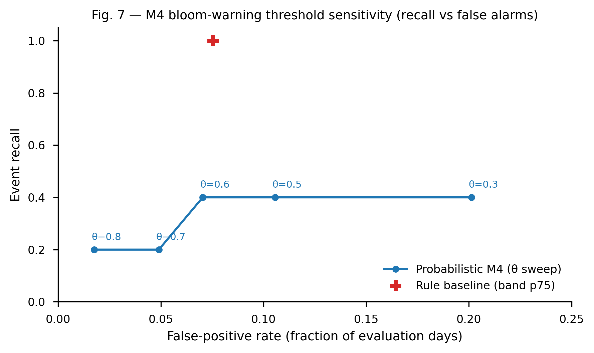
**图 7.** 不同概率阈值 θ（0.3—0.8）下藻华预警的召回率—误报权衡，并给出基于规则的基线参考点。
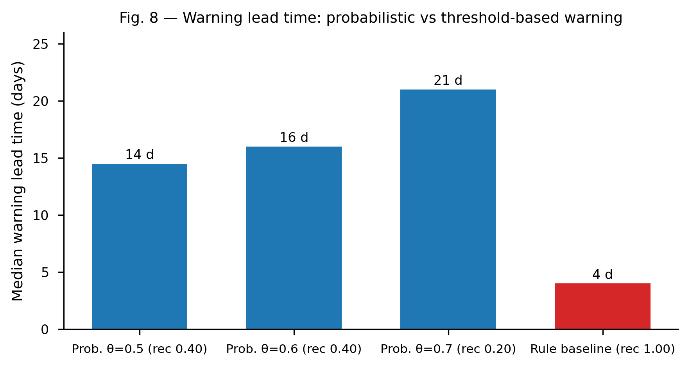
**图 8.** 预警提前量中位数：概率预警（θ=0.5—0.7）可达 14—21 天，而基于规则的阈值基线仅为 4 天——提前量提升 3.6 倍，且误报减半。

**概率化预警将提前量提升 3.6 倍。** 在阈值 θ=0.5 下，模型召回率为 0.4，提前量中位数为 14.5 天（13—16 天），误报 6 段。阈值基线（表层带 p75）：召回率 1.0，但提前量仅为 4 天，误报 14 段。模型以误报减半为代价，换来了 3.6 倍的提前量提升。

### 3.4 垂向结构与因果关系
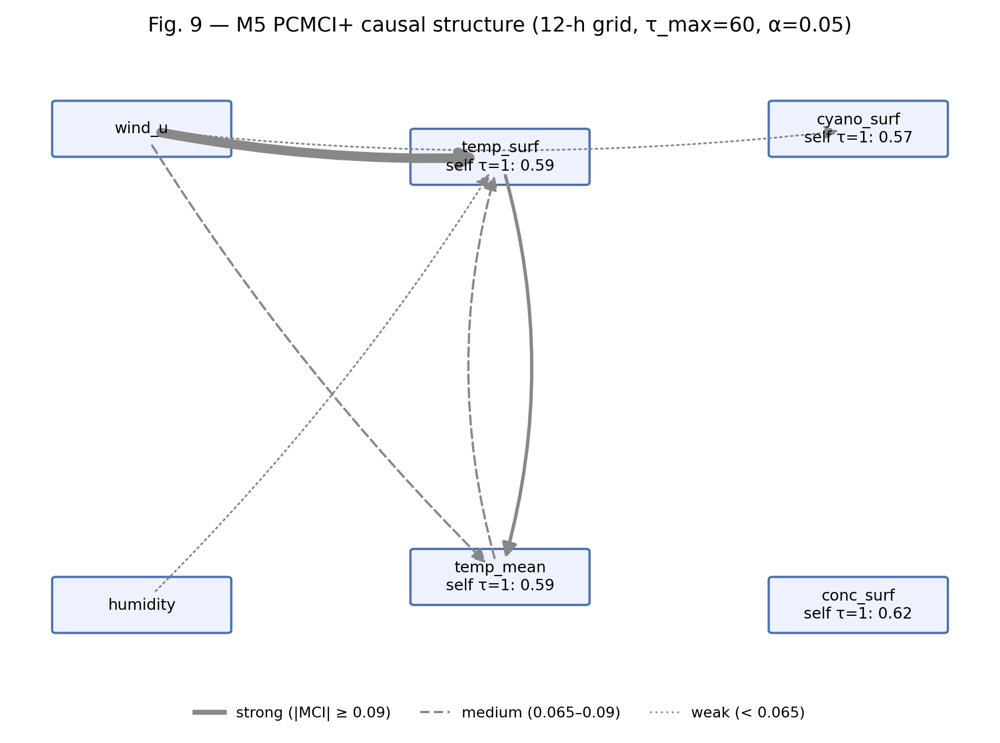
**图 9.** PCMCI+ 因果结构：藻类浓度受自回归主导（τ=1，r=0.63）；气象驱动因子影响较弱（wind_u r≈0.07）；藻华期间分层状态解耦。

PCMCI+ 分析表明，藻类浓度主要由其自身的自回归过程主导（τ=1，r=0.63）；气象驱动因子的直接效应较弱（wind_u r≈0.07）；藻华期间分层状态解耦（表层与 10 m 深的相关系数由非藻华期的 0.57 降至 −0.07）。

### 3.5 消融研究
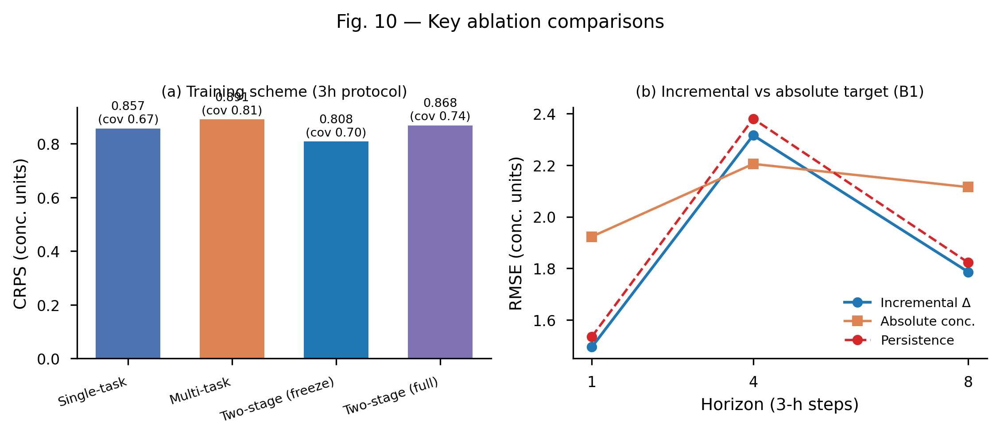
**图 10.** 关键消融实验：两阶段训练（ts_freeze 精度最优）、增量目标相对绝对目标、多任务相对单任务（校准改善）。

- 增量目标相对绝对目标：增量目标在所有视界上均胜出
- 多任务相对单任务：多任务改善区间校准（覆盖率由 0.67 提升至 0.81）
- 两阶段相对联合训练：两阶段训练（ts_freeze）精度最优
- 日尺度相对 3 小时尺度：对于 7 天视界，日尺度更优

### 3.6 框架对比
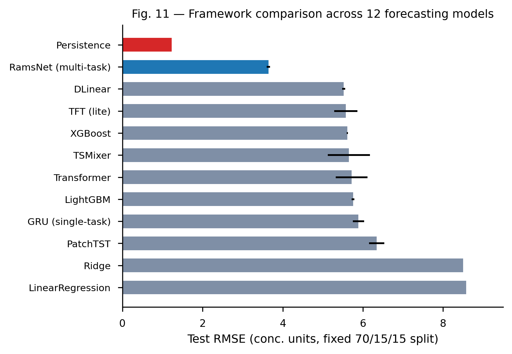
**图 11.** 12 个框架的 RMSE 对比：RAMS-Net（GRU 多任务，3.64）最优，优于 DLinear、TFT、XGBoost、LightGBM、Transformer、PatchTST 等框架。

RAMS-Net（GRU 多任务）优于全部备选框架：DLinear、TFT、XGBoost、LightGBM、Transformer、PatchTST——对于本数据规模，GRU 多任务架构是最优选择。

---

## 4. 讨论

### 4.1 增量预测为何有效
藻类浓度是一个强自回归过程（τ=1，r=0.63）。持久性基线（当前值）本身已能捕捉约 80% 的水平信息。对*变化量*（Δ）建模，使网络能够学习修正项，而非冗余地对水平进行重复建模——这是本研究的核心洞见，可推广至其他强自相关的环境变量。

### 4.2 多任务正则化
分层与预警两个任务头起到正则化的作用，在不牺牲点预测精度的前提下改善了区间校准。这与多任务学习的理论一致：辅助任务提供了归纳偏置（inductive bias）。

### 4.3 过程尺度匹配
相对于 3 小时采样配合 24 小时视界，日尺度采样配合 7 天视界与藻类生长（倍增时间 1—3 天）和气象滞后（13—30 天）的时间尺度更为匹配。这表明采样分辨率应与主导过程的时间尺度相匹配。

### 4.4 局限性
- **信息上限**：oracle 探针实验表明，当前数据已接近其可预测极限；纯自回归已能捕捉大部分信号。进一步改进需要更多数据（多站点、营养盐、入流）。
- **方向可预测性**：P(Δ>0) 的判别能力较弱（AUC 0.59）；变化方向在很大程度上不可预测。
- **季节性漂移**：由于年际非平稳性，各窗口的区间覆盖率存在波动（0.66—0.94）；共形校准仅能部分缓解。

---

## 5. 结论
本研究开发了 RAMS-Net，一个面向垂向分层水库藻类预测的多任务深度学习框架。主要结论包括：(1) 增量预测相对持久性基线的 CRPS 技巧得分提升 +22.1%；(2) 日尺度过程匹配改善了长时距预测；(3) 概率化藻华预警的提前量提升 3.6 倍，且误报更少；(4) 多任务架构实现了预测区间的良好校准。该框架为水库藻类监测与藻华预警提供了一种具有科学依据、可实际部署的方法。

## 致谢
数据依据保密协议提供，并已进行去标识化处理。

## 参考文献
*（拟补充 ≥15 篇参考文献，其中近 5 年文献占比 60%）*

1. Rousso et al. Water Research 2020 — cyanobacteria forecasting review
2. Hipsey et al. GMD 2019 — General Lake Model
3. Carey et al. Inland Waters 2022 — FLARE forecasting
4. Thomas et al. WRR 2020 — iterative forecasting
5. Runge et al. — PCMCI+ causality
6. Romano et al. 2019 — conformal prediction (CQR)
...
